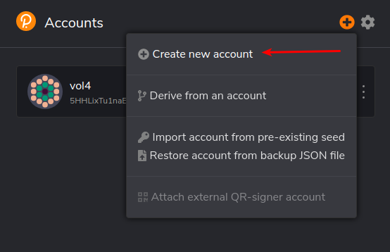
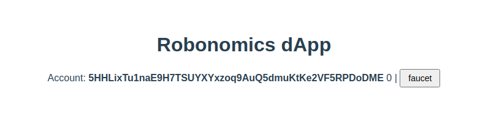
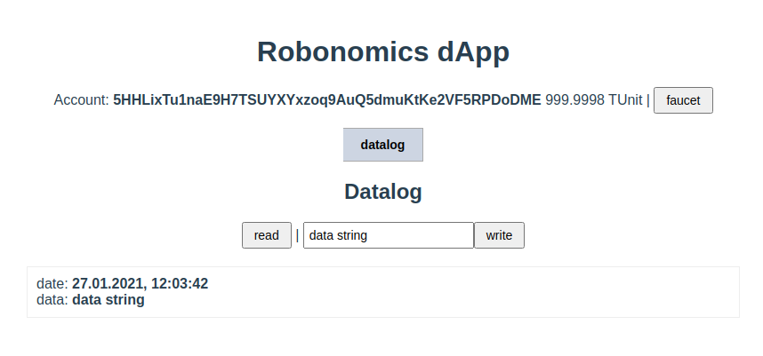
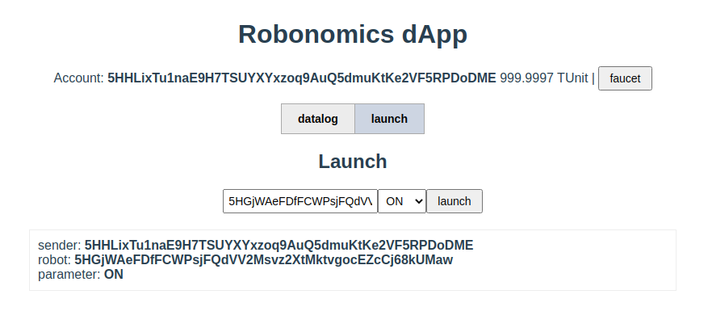
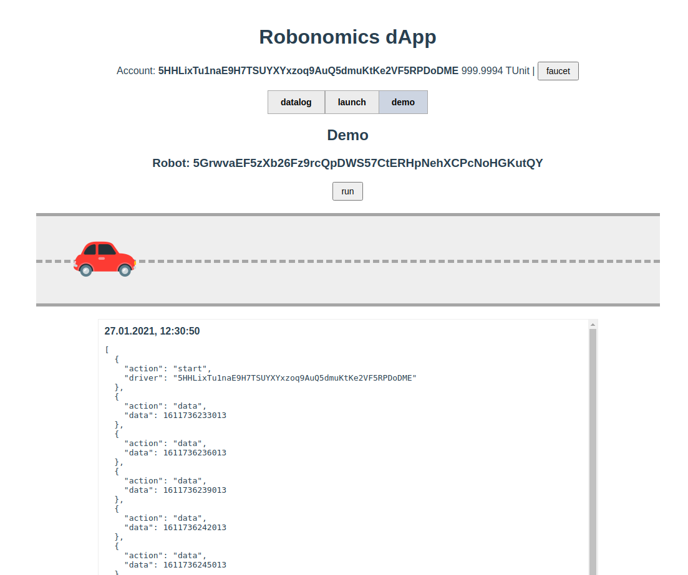

# Зимняя школа робономики

## Подготовка

### Запуск узла робономики

Для разработки дапп и тестирования, мы будем использовать локальную ноду робономики.
Для этого необходимо скачать, скомпилированный, бинарный файл https://github.com/airalab/robonomics/releases.
Я буду использовать Ubuntu, по этому я скачиваю соответствующую версию.

Распаковываем архив
```sh
unzip robonomics-ubuntu-0.23.0-x86_64.zip
```

Теперь можно запустить узел в режиме разработки. Для этого используем ключ --dev
```sh
./robonomics --dev
```

### Браузерное расширение

Для хранения ключей в браузере существует расширением `polkadot{.js} extension`. В дапп мы будем его использовать для подписи транзакций.

На текущий момент расширение доступно для `Google chrome` и `Firefox` https://polkadot.js.org/extension/

После установки расширения создаем новый аккаунт.


> Первый шаг закончен.

## Разработка дапп

> Дапп будем писать с использованием фреймворка vue.js, хотя можно использовать все что нравиться, умеете.

Начнем разработку дапп с создания стартового приложения на vue.js
И тут можно поступить двумя способами.

Способ 1:

С использованием консольной утилитой `Vue cli`
Для этого необходимо ее установить https://cli.vuejs.org/guide/installation.html

После установки можно будет в терминале выполнить команду

```sh
vue create mydapp
```

Отвечаем на несколько вопросов, мастера установки.

Способ 2:

Склонировать подготовленный git репозиторий с примером и переключиться на шаг №1

```sh
git clone https://github.com/vol4tim/example-robonomics-dapp.git mydapp
git checkout step-1
```

В итоге получим директорию с установленым стартовым приложением, которое уже можно запустить и открыть в браузере.

```sh
cd mydapp
yarn
yarn serve
```

### Начинаем работать с polkadot.js

#### Установка зависимостей

Для подключения дапп к чейну Робономики, существует библиотека `@polkadot/api`. А для взаимодействия дапп с расширением с ключами библиотека `@polkadot/extension-dapp`. Их нам и нужно установить в наше приложение.

```sh
yarn add @polkadot/api @polkadot/extension-dapp
```

#### Подключение к робономике

Для начала сделаем конфигурационный файл с параметрами подключения к ноде робономики. В репозитории с демо, есть пример данного файла `config.template.json`.

`src/config.json`
```json
{
  "endpoint": "ws://localhost:9944",
  "types": {
    "Record": "Vec<u8>",
    "TechnicalParam": "Vec<u8>",
    "TechnicalReport": "Vec<u8>",
    "EconomicalParam": "{}",
    "ProofParam": "MultiSignature",
    "LiabilityIndex": "u64",
    "Address": "MultiAddress",
    "LookupSource": "MultiAddress",
    "Parameter": "Bool",
    "BlockLength": "(u32,u32,u32)"
  }
}
```

В этом файле мы указываем ноду к которой подключаемся и кастомные типы, типы для робономики можно взять с github https://github.com/airalab/robonomics/blob/master/bin/node/cli/res/custom_types.json

Теперь необходимо написать скрипт для подключения к нашей запущенной ноде.

`src/utils/api.js`
```js
import { ApiPromise, WsProvider } from "@polkadot/api";
import config from "../config.json";

let api;
export async function initApi() {
  const provider = new WsProvider(config.endpoint);
  api = await ApiPromise.create({
    provider,
    types: config.types
  });
  return api;
}

export function getApi() {
  return api;
}
```

Чтобы мы могли подписывать транзакции ключем из расширения, добавим две функции подключения к расширению и функию инициализации аккаунта.

`src/utils/api.js`
```js
...
import {
  web3Accounts,
  web3Enable,
  web3FromAddress
} from "@polkadot/extension-dapp";

async function getExtension() {
  const extensions = await web3Enable("demo");
  if (extensions.length === 0) throw new Error("no extension");
  return extensions[0];
}

export async function initAccount(index = 0) {
  const timeout = new Promise(resolve => {
    setTimeout(resolve, 300);
  });
  await timeout;
  await getExtension();
  const accounts = await web3Accounts();
  if (accounts.length > 0) {
    const injector = await web3FromAddress(accounts[index].address);
    api.setSigner(injector.signer);
    return accounts[index].address;
  }
  throw new Error("no accounts");
}
...
```

Наш аккаунт будет с нулевым балансом, а нам потребуется немного средств, поэтому нам нужно сделать еще функцию крана. Тк мы запустили робономику с ключом `--dev`, у нас есть аккаунт `Alice` с большим балансом, у него и будем запрашивать средства.

`src/utils/api.js`
```js
...
import { Keyring } from "@polkadot/keyring";

export function getBalance(account, cb) {
  api.query.system.account(account, ({ data: { free: currentFree } }) => {
    cb(currentFree);
  });
}

export const keyring = new Keyring({ type: "sr25519" });

export async function faucet(address) {
  keyring.setSS58Format(api.registry.chainSS58);
  const account = keyring.addFromUri("//Alice");
  const tx = api.tx.balances.transfer(address, 1000000000000000);
  await tx.signAndSend(account);
}
...
```

Полная версия скрипта https://github.com/vol4tim/example-robonomics-dapp/blob/master/src/utils/api.js

Если приложение начинали с клонирования репозитория, то чтобы выполнить данные действия достаточно переключиться на шаг 2 и доустановить зависимости.

```sh
git checkout step-2
cp src/config.template.json src/config.json
yarn
```

### Vue компонет подключения

#### Подключение

Скрипт для подключения у нас уже написан. Теперь можно его использовать на нашем интерфейсе. В корневом компоненте `App.vue` для этого достаточно вызвать написаную функцию `initApi`. И пока пользователь ожидает подключения, мы ему покажем небольшой лоадер, пока в виде многоточия.

Шаблон компонента и базовые стили.

`src/App.vue`
```js
<template>
  <div id="app">
    <h1>Robonomics dApp</h1>
    <div v-if="load">...</div>
    <template v-else>
      <div v-if="error" class="error">{{ error }}</div>
      <template v-else-if="api">
        connected
      </template>
    </template>
  </div>
</template>

...

<style>
#app {
  font-family: Avenir, Helvetica, Arial, sans-serif;
  -webkit-font-smoothing: antialiased;
  -moz-osx-font-smoothing: grayscale;
  text-align: center;
  color: #2c3e50;
  margin-top: 60px;
}
button {
  font-size: 14px;
  padding: 5px 12px;
}
button:hover {
  cursor: pointer;
}
input {
  font-size: 14px;
  padding: 5px;
}
select {
  font-size: 14px;
  padding: 5px;
}
button:focus,
input:focus {
  outline: none;
}
.error {
  color: rgb(151, 31, 31);
  font-weight: bold;
  text-align: center;
  margin: 10px 0;
}
</style>
```

Код компонента в котором и будет вызвана функция `initApi`

`src/App.vue`
```js
<script>
import { initApi } from "./utils/api";

export default {
  name: "App",
  data() {
    return {
      load: false,
      api: null,
      error: null
    };
  },
  created() {
    this.init();
  },
  methods: {
    async init() {
      try {
        this.load = true;
        this.api = await initApi();
        this.load = false;
      } catch (error) {
        this.error = error.message;
        this.load = false;
      }
    }
  }
};
</script>
```

#### Аккаунт с балансом

Теперь мы можем использовать наш аккаунт, пополнить его баланс и показать на интерфейсе.

В шаблон добавим соответсвующию разметку

`src/App.vue`

```js
<template>
  ...
      <template v-else-if="api && account">
        <p>
          Account: <b>{{ account }}</b> {{ balance }} |
          <button @click="faucet">
            faucet
          </button>
        </p>
      </template>
  ...
</template>
```

Добавим новые поля для адреса аккаунта и баланса

`src/App.vue`
```js
...
data() {
  return {
    ...
    account: null,
    balance: 0,
    ...
  };
}
...
```

В функцию `init` нужно добавить инициализацию акканта и получить его баланс

`src/App.vue`
```js
...
async init() {
  ...
  this.account = await initAccount();
  getBalance(this.account, balance => {
    this.balance = formatBalance(balance);
  });
  ...
}
...
```

Осталось добавить функцию пополнения баланса, при нажатии на кнопку

`src/App.vue`
```js
...
faucet() {
  faucet(this.account);
}
...
```

https://github.com/vol4tim/example-robonomics-dapp/blob/master/src/App.vue

Если приложение начинали с клонирования репозитория, то чтобы выполнить данные действия достаточно переключиться на шаг 3.

```sh
git checkout step-3
```

В результате мы получим в браузере данную картинку



### Datalog

Для сохранения и чтения любых данных в чейн используем модуль `datalog`

Для примера, как использовать данный модуль, сделаем компонет `Datalog.vue`

В разметке у нас будет кнопка для чтения данных `read` с блоком в котором будем выводить список в виде даты и самих данных. И форма с текстовым инпутом в который можно будет внести любые данные в виде строки и кнопка `write`.

`src/components/Datalog.vue`
```js
<template>
  <div>
    <h2>Datalog</h2>
    <button @click="read">read</button> |
    <input v-model="data" :disabled="isWrite" />
    <button @click="write" :disabled="isWrite">write</button>
    <div v-if="error" class="error">{{ error }}</div>
    <div v-if="log" class="log">
      <p v-if="log.length === 0" class="error">Not found</p>
      <div v-for="(item, k) in log" :key="k" class="row">
        date: <b>{{ item[0] | dateFormat }}</b>
        <br />
        data: <b>{{ item[1] | dataFormat }}</b>
      </div>
    </div>
  </div>
</template>

...

<style scoped>
.log {
  border: 1px solid #eee;
  text-align: left;
  width: 800px;
  margin: 20px auto;
}
.log .row {
  margin: 10px;
}
</style>
```

Код компонента. Тут основной момент в отправке транзакции, вызвать функцию через api в которую передаем данные и подписываем своим аккаунтом `this.api.tx.datalog.record(stringToHex(this.data)).signAsync(this.account);`

`src/components/Datalog.vue`
```js
<script>
import { stringToHex, u8aToString } from "@polkadot/util";
export default {
  props: ["api", "account"],
  data() {
    return {
      data: "data string",
      log: null,
      isWrite: false,
      error: ""
    };
  },
  filters: {
    dateFormat: function(v) {
      return new Date(Number(v)).toLocaleString();
    },
    dataFormat: function(v) {
      return u8aToString(v);
    }
  },
  methods: {
    async read() {
      this.log = (await this.api.query.datalog.datalog(this.account)).toArray();
    },
    async write() {
      try {
        this.error = "";
        this.isWrite = true;
        const tx = await this.api.tx.datalog
          .record(stringToHex(this.data))
          .signAsync(this.account);
        await tx.send(result => {
          if (result.status.isInBlock) {
            this.read();
            this.isWrite = false;
          }
        });
      } catch (error) {
        this.error = error.message;
        this.isWrite = false;
      }
    }
  }
};
</script>
```

https://github.com/vol4tim/example-robonomics-dapp/blob/master/src/components/Datalog.vue

Если приложение начинали с клонирования репозитория, то чтобы выполнить данные действия достаточно переключиться на шаг 4.

```sh
git checkout step-4
```

В результате мы получим в браузере данную картинку



### Launch

Данная функция используется для запуска и остановки робота. Для демонтрации как использовать данный модуль, напишем компонент `Launch.vue`.

В шаблоне компонента у нас будет форма в которой можно указать адрес робота, переключатель ON/OFF и кнопка для отправки.

`src/components/Launch.vue`
```js
<template>
  <div>
    <h2>Launch</h2>
    <input v-model="robot" :disabled="isWrite" placeholder="Robot address" />
    <select v-model="parameter" :disabled="isWrite">
      <option value="ON">ON</option>
      <option value="OFF">OFF</option>
    </select>
    <button @click="launch" :disabled="isWrite">launch</button>
    <div v-if="error" class="error">{{ error }}</div>
    <div v-if="log.length > 0" class="log">
      <div v-for="(item, k) in log" :key="k" class="row">
        sender: <b>{{ item.sender }}</b>
        <br />
        robot: <b>{{ item.robot }}</b>
        <br />
        parameter: <b>{{ item.parameter ? "ON" : "OFF" }}</b>
      </div>
    </div>
  </div>
</template>

...

<style scoped>
.log {
  border: 1px solid #eee;
  text-align: left;
  width: 800px;
  margin: 20px auto;
}
.log .row {
  margin: 10px;
}
</style>
```

Код похож на компонет `Datalog.vue` отличается только в чтении. Робот будет получать команду через события (events).

`src/components/Launch.vue`
```js
<script>
export default {
  props: ["api", "account"],
  data() {
    return {
      robot: this.account,
      parameter: "ON",
      log: [],
      isWrite: false,
      error: "",
      unsubscribe: null
    };
  },
  async created() {
    this.unsubscribe = await this.api.query.system.events(events => {
      events.forEach(record => {
        const { event } = record;
        if (event.section === "launch" && event.method === "NewLaunch") {
          const sender = event.data[0].toString();
          const robot = event.data[1].toString();
          const parameter = event.data[2].toHuman();
          this.log.push({
            sender,
            robot,
            parameter
          });
        }
      });
    });
  },
  destroyed() {
    if (this.unsubscribe) {
      this.unsubscribe();
    }
  },
  methods: {
    async launch() {
      try {
        this.error = "";
        this.isWrite = true;
        const tx = await this.api.tx.launch
          .launch(this.robot, this.parameter === "ON")
          .signAsync(this.account);
        await tx.send(result => {
          if (result.status.isInBlock) {
            this.isWrite = false;
          }
        });
      } catch (error) {
        this.error = error.message;
        this.isWrite = false;
      }
    }
  }
};
</script>
```

https://github.com/vol4tim/example-robonomics-dapp/blob/master/src/components/Launch.vue

Если приложение начинали с клонирования репозитория, то чтобы выполнить данные действия достаточно переключиться на шаг 5.

```sh
git checkout step-5
```

В результате мы получим в браузере данную картинку



### Demo

В данной демонстрации у нас будет автомобиль, который можно будет запустить и остановить через дапп. Аавтомобиль во время поездки собирает лог, а после остановки сохраняет его в чейн.
Тут как раз применим оба модуля в связке, которые мы попробовали по отдельности.

Для эмуляции поведения робота (авто) напишем класс `Robot`. А в качестве аккаунта для даного робота будем использовать ключ `Alice`. Класс `Robot` будет следить за событиями `NewLaunch`, чтобы включиться и выключиться. А после включения начинает в лог собирать данные, в качетсве данных это будет просто временная метка. А после выключения сохранять данный лог в модуль `datalog`.

`src/utils/robot.js`
```js
import { stringToHex } from "@polkadot/util";
import { keyring } from "./api";

export default class Robot {
  ...
}
```

Полный код файла https://github.com/vol4tim/example-robonomics-dapp/blob/master/src/utils/robot.js

Для визуализации создадим компонет `Demo.vue` в котором будет кнопка запуска, анимация авто и вывод лога.

`src/components/Demo.vue`
```js
<template>
  <div>
    <h2>Demo</h2>
    <template v-if="robot">
      <h3>Robot: {{ robot.address }}</h3>
      <p v-if="robot.state">Driver: {{ robot.driver }}</p>
      <button @click="run" :disabled="isWrite">
        <template v-if="!robot.state">run</template>
        <template v-else>stop</template>
      </button>
      <div class="road">
        <div
          class="robot"
          :class="[robot.state ? 'robot-play' : 'robot-stop']"
        ></div>
      </div>
      <div v-if="error" class="error">{{ error }}</div>
      <div v-if="log" class="log">
        <p v-if="log.length === 0" class="error">Not found</p>
        <div v-for="(item, k) in log" :key="k" class="row">
          <b>{{ item[0] | dateFormat }}</b>
          <pre>{{ item[1] | dataFormat }}</pre>
        </div>
      </div>
    </template>
  </div>
</template>

...

<style scoped>
.log {
  border: 1px solid #eee;
  text-align: left;
  width: 800px;
  margin: 20px auto;
  height: 500px;
  overflow-y: auto;
}
.log .row {
  margin: 10px;
  border-bottom: 1px solid #eee;
}
.road {
  width: 1000px;
  margin: 20px auto;
  background-color: #eee;
  padding: 20px 0;
  border: 5px solid #a5a5a5;
  border-left: 0;
  border-right: 0;
  position: relative;
}
.road::before {
  content: " ";
  width: 1000px;
  border-top: 5px dashed #a5a5a5;
  position: absolute;
  top: 50%;
  left: 0;
}
@keyframes move {
  from {
    transform: translateX(0);
  }
  to {
    transform: translateX(100%);
  }
}
.robot {
  height: 100px;
  width: 100px;
  color: #fff;
  font-weight: bold;
  font-style: 14px;
  animation: move 30s linear infinite;
  border-radius: 0 10px 10px 0;
  background: url("../assets/car.png") no-repeat 0 0;
  background-size: cover;
}
.robot-play {
  animation-play-state: running;
}
.robot-stop {
  animation-play-state: paused;
}
</style>
```

Код компонента. Тут нам нужно создать экземпляр класса `Robot` и функцию запуска и остановки.

`src/components/Demo.vue`
```js
...
<script>
import { u8aToString } from "@polkadot/util";
import Robot from "../utils/robot";

export default {
  props: ["api", "account"],
  data() {
    return {
      isWrite: false,
      error: "",
      robot: null,
      log: []
    };
  },
  filters: {
    dateFormat: function(v) {
      return new Date(Number(v)).toLocaleString();
    },
    dataFormat: function(v) {
      return JSON.parse(u8aToString(v));
    }
  },
  async created() {
    this.robot = new Robot("//Alice", this.api);
    await this.robot.subscribeLog(r => {
      this.log = r.reverse().map(item => {
        return [item[0], item[1]];
      });
    });
  },
  destroyed() {
    this.robot.destroy();
  },
  methods: {
    async run() {
      try {
        this.error = "";
        this.isWrite = true;
        const tx = await this.api.tx.launch
          .launch(this.robot.account.address, !this.robot.state)
          .signAsync(this.account);
        await tx.send(result => {
          if (result.status.isInBlock) {
            this.isWrite = false;
          }
        });
      } catch (error) {
        this.error = error.message;
        this.isWrite = false;
      }
    }
  }
};
</script>
...
```

https://github.com/vol4tim/example-robonomics-dapp/blob/master/src/components/Demo.vue

Если приложение начинали с клонирования репозитория, то чтобы выполнить данные действия достаточно переключиться на шаг 6.

```sh
git checkout step-6
```

В результате мы получим в браузере данную картинку



На этом наш урок подошел к концу.

Спасибо!
